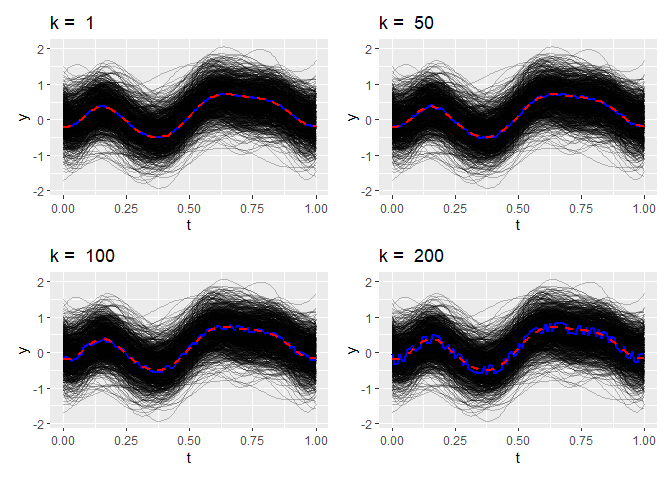

localFDA
========

<!-- badges: start -->

[](https://www.gnu.org/licenses/gpl-3.0)
[](https://travis-ci.com/aefdz/localFDA)
<!-- badges: end -->

Overview
--------

Software companion for the paper “Localization processes for functional
data analysis” by Elías, Antonio, Jiménez, Raúl, and Yukich, Joe, (2020)
\<arXiv:2007.16059\>. It provides the code for computing localization
processes and localization distances.

Installation
------------

``` r
#install the package
devtools::install_github("aefdz/localFDA")
```

    ##          checking for file 'C:\Users\anton\AppData\Local\Temp\RtmporkyAC\remotes2a347944483f\aefdz-localFDA-3fd4807/DESCRIPTION' ...  v  checking for file 'C:\Users\anton\AppData\Local\Temp\RtmporkyAC\remotes2a347944483f\aefdz-localFDA-3fd4807/DESCRIPTION' (697ms)
    ##       -  preparing 'localFDA':
    ##    checking DESCRIPTION meta-information ...     checking DESCRIPTION meta-information ...   v  checking DESCRIPTION meta-information
    ##       -  checking for LF line-endings in source and make files and shell scripts
    ##       -  checking for empty or unneeded directories
    ##       -  looking to see if a 'data/datalist' file should be added
    ##       -  building 'localFDA_0.0.0.9000.tar.gz'
    ##      
    ## 

``` r
#load the package
library(localFDA)
```

Test usage
----------

Load the example data and plot it.

``` r
X <- exampleData
n <- ncol(X)
p <- nrow(X)
t <- as.numeric(rownames(X))

#plot the data set
df_functions <- data.frame(ids = rep(colnames(X), each = p),
                           y = c(X),
                           x = rep(t, n)
                           )

functions_plot <- ggplot(df_functions) + 
                  geom_line(aes(x = x, y = y, group = ids, color = ids), 
                            color = "black", alpha = 0.25) + 
                  xlab("t") + theme(legend.position = "none")


functions_plot
```


### Compute *kth empirical localization processes*

Empirical version of Equation (1) of the paper. For one focal,

``` r
focal <- "1"

localizarionProcesses_focal <- localizationProcesses(X, focal)$lc
```

Plot localization processes of order 1, 50, 100 and 200:

``` r
df_lc <- data.frame(k = rep(colnames(localizarionProcesses_focal), each = p),
                           y = c(localizarionProcesses_focal),
                           x = rep(t, n-1)
                           )

lc_plots <- list()
ks <- c(1, 50, 100, 200)

for(i in 1:4){
  lc_plots[[i]] <- functions_plot + 
                   geom_line(data = filter(df_lc, k == paste0("k=", ks[i])), 
                             aes(x = x, y = y, group = k), 
                             color = "blue", size = 1) +
                   geom_line(data = filter(df_functions, ids == focal), 
                             aes(x = x, y = y, group = ids), 
                             color = "red", linetype = "dashed", size = 1)+
                   ggtitle(paste("k = ", ks[i]))
}

wrap_plots(lc_plots)
```



### Compute *kth empirical localization distances*

Equation (18) of the paper. For one focal,

``` r
localizationDistances_focal <- localizationDistances(X, focal)

head(localizationDistances_focal)
```

    ##          k=1          k=2          k=3          k=4          k=5          k=6 
    ## 0.0005082926 0.0011346495 0.0017636690 0.0023955745 0.0030095117 0.0035089220

Plot the localization distances:

``` r
df_ld <- data.frame(k = names(localizationDistances_focal),
                           y = localizationDistances_focal,
                           x = 1:c(n-1)
                           )


ldistances_plot <- ggplot(df_ld, aes(x = x, y = y)) + 
                   geom_point() + 
                   ggtitle("Localization distances for one focal") + 
                   xlab("kth") + ylab("L")

ldistances_plot
```


### Sample *μ* and *σ*

``` r
localizationStatistics_full <- localizationStatistics(X, robustify = TRUE)

#See the mean and sd estimations for k = 1, 100, 200, 400, 600

localizationStatistics_full$trim_mean[c(1, 100, 200, 400, 600)]
```

    ##         k=1       k=100       k=200       k=400       k=600 
    ## 0.001083517 0.098465426 0.184940365 0.350528860 0.526580274

``` r
localizationStatistics_full$trim_sd[c(1, 100, 200, 400, 600)]
```

    ##          k=1        k=100        k=200        k=400        k=600 
    ## 0.0005326429 0.0329170846 0.0490732397 0.0686018224 0.0806314699

### Classification

``` r
X <- classificationData

ids_training <- sample(colnames(X), 90)
ids_testing <- setdiff(colnames(X), ids_training)

trainingSample <- X[,ids_training]
testSample <- X[,ids_testing]; colnames(testSample) <- NULL #blind 
classNames <- c("G1", "G2")

classification_results <- localizationClassifier(trainingSample, testSample, classNames, k_opt = 3)

checking <- data.frame(real_classs = ids_testing, 
                      predicted_class =classification_results$test$predicted_class)
```

### Outlier detection

``` r
X <- outlierData

outliers <- outlierLocalizationDistance(X, localrule = 0.95, whiskerrule = 1.5)

outliers$outliers_ld_rule
```

    ## [1] "1_magnitude" "1_shape"     "2_magnitude" "2_shape"

Plot results,

``` r
df_functions <- data.frame(ids = rep(colnames(X), each = nrow(X)),
                           y = c(X),
                           x = rep(seq(from = 0, to = 1, length.out = nrow(X)), ncol(X)))
                           

functions_plot <- ggplot(df_functions) + 
                  geom_line(aes(x = x, y = y, group = ids), 
                            color = "black") + 
                  xlab("t") + 
  theme(legend.position = "bottom")+
                  geom_line(data = df_functions[df_functions$ids %in% outliers$outliers_ld_rule,], aes(x = x, y = y, group = ids, color = ids), size = 1) +
  guides(color = guide_legend(title="Detected outliers"))

functions_plot 
```


References
----------

Elías, Antonio, Jiménez, Raúl and Yukich, Joe (2020). Localization
processes for functional data analysis
\[\<arXiv:2007.16059\>\]<a href="https://arxiv.org/abs/2007.16059" class="uri">https://arxiv.org/abs/2007.16059</a>.
